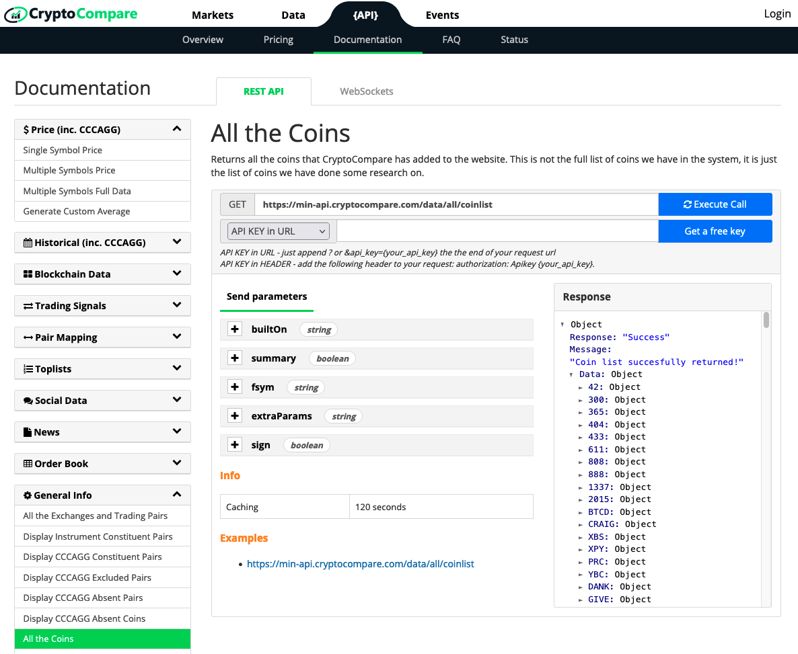
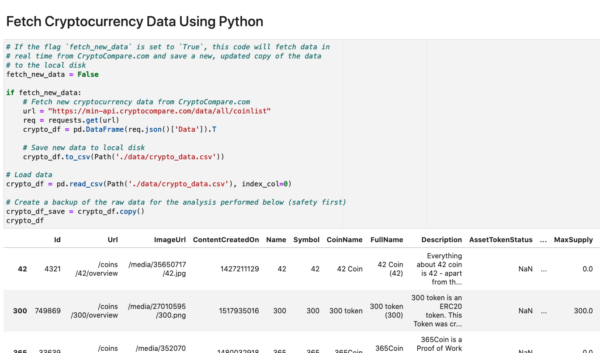
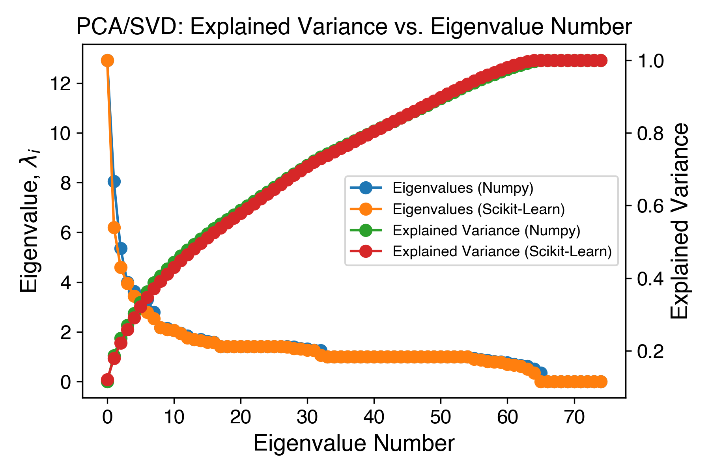
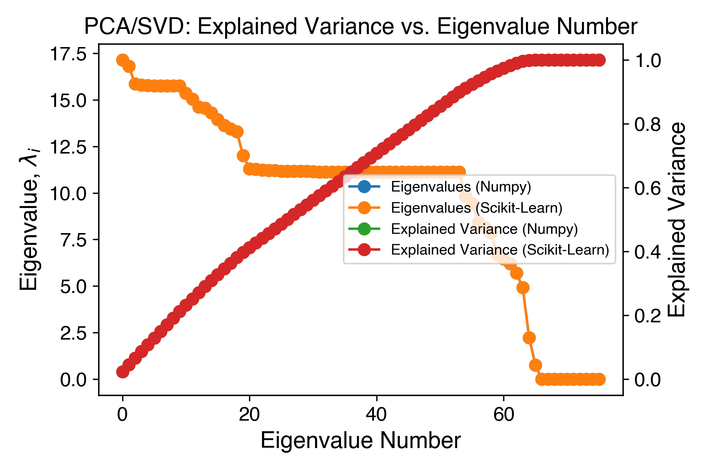

# Clustering Cryptocurrency  <!-- omit in toc -->

</img>
*[Cryptocurrencies coins by Worldspectrum](https://www.pexels.com/@worldspectrum?utm_content=attributionCopyText&utm_medium=referral&utm_source=pexels) | [Free License](https://www.pexels.com/photo-license/)*

---

## Table of Contents  <!-- omit in toc -->

- [1. Introduction](#1-introduction)
- [2. Analysis Pipeline](#2-analysis-pipeline)
  - [2.1. Fetch Raw Data](#21-fetch-raw-data)
  - [2.2. Data Preprocessing](#22-data-preprocessing)
  - [2.3. Reducing Dimensionality Using PCA/SVD](#23-reducing-dimensionality-using-pcasvd)
  - [2.4. Clustering Cryptocurrencies Using K-Means](#24-clustering-cryptocurrencies-using-k-means)
- [3. Results](#3-results)
- [4. Conclusion](#4-conclusion)

## 1. Introduction

## 2. Analysis Pipeline

### 2.1. Fetch Raw Data

Data is fetched in real time from [CryptoCompare.com](https://www.cryptocompare.com/) using Python's `request` module (see below).  If the flag `fetch_new_data` is set to true, the code will get a fresh copy of the most up-to-date data from CryptoCompare and save a copy of it to the local file named "`./data/crypto_data.csv`".

### 2.2. Data Preprocessing

### 2.3. Reducing Dimensionality Using PCA/SVD

TODO: Description.

Dimensionality Reduction After Scikit-Learn's `StandardScaler()`

TODO: Description.

### 2.4. Clustering Cryptocurrencies Using K-Means

## 3. Results

## 4. Conclusion
