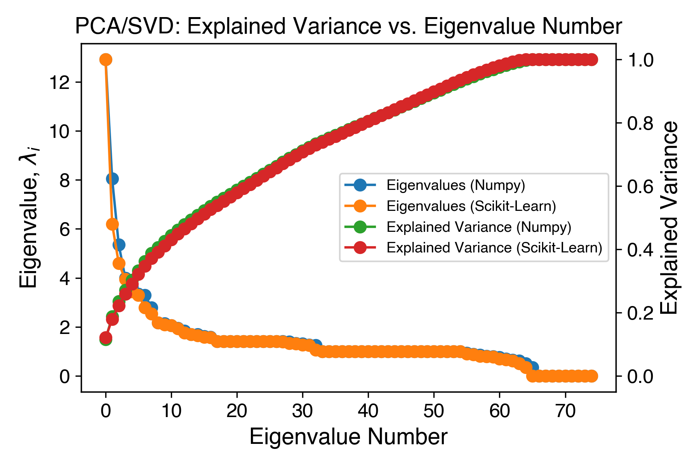
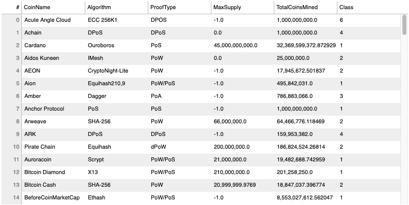

<!--
Notes To Myself:

- [ ] Add animated GIF near top of README.md

-->
# Clustering Cryptocurrency  <!-- omit in toc -->

</img>
*Image Credit (Above): [Worldspectrum](https://www.pexels.com/@worldspectrum?utm_content=attributionCopyText&utm_medium=referral&utm_source=pexels) | [Free License](https://www.pexels.com/license/)*

</img>

---

## Table of Contents  <!-- omit in toc -->

- [1. Introduction](#1-introduction)
  - [1.1. Tools and Technologies Utilized](#11-tools-and-technologies-utilized)
  - [1.2. Important Files](#12-important-files)
- [2. Analysis Pipeline](#2-analysis-pipeline)
  - [2.1. Fetch Cryptocurrency Data from CryptoCompare](#21-fetch-cryptocurrency-data-from-cryptocompare)
  - [2.2. Preprocess the Data](#22-preprocess-the-data)
  - [2.3. Reducing Dimensionality Using PCA/SVD](#23-reducing-dimensionality-using-pcasvd)
  - [2.4. Clustering Cryptocurrencies Using K-Means](#24-clustering-cryptocurrencies-using-k-means)
- [3. Visualizing Results](#3-visualizing-results)
- [4. Conclusion](#4-conclusion)

---

## 1. Introduction

Diversification across assets is a cornerstone of modern portfolio theory, however, the universe of cryptocurrencies is rapidly evolving, technologically complex, and difficult to understand.  Bitcoin (BTC) and Ether (ETH) are the obvious choices of cryptocurrencies in which to invest, but what about some of the other cryptocurrencies out there?  How do other cryptocurrencies compare to BTC and ETH?  Here, we use Python to fetch raw cryptocurrency coin information and machine-learning techniques for dimensionality reduction and clustering in an effort to make sense of the universe of investible cryptocurrencies.  This is analysis is useful, for example, if an investor would like to diversify assets across cryptocurrency types, yet is unsure of which cryptocurrencies to invest in.  

### 1.1. Tools and Technologies Utilized

- [Python](https://www.python.org/) for scraping cryptocurrency data from [CryptoCompare.com](https://www.cryptocompare.com/) in real time
- [Pandas](https://pandas.pydata.org/) for exploring and preprocessing data for machine-learning algorithms
- [Scikit-Learn](https://scikit-learn.org/stable/index.html) for dimensionality reduction using Principal Component Analysis (PCA)
- [Numpy](https://numpy.org/) for comparison of PCA to Singular Value Decomposition (SVD)
- [Scikit-Learn](https://scikit-learn.org/stable/index.html) for clustering using K-Means Clustering
- [Matplotlib](https://matplotlib.org/), [hvPlot](https://hvplot.holoviz.org/), and [Plotly](https://plotly.com/python/) for visualization

### 1.2. Important Files

- [crypto_clustering.ipynb](crypto_clustering.ipynb): Main analysis notebook.
- [data/crypto_data.csv](./data/crypto_data.csv): Most recent version of raw cryptocurrency data fetched from [CryptoCompare.com](https://www.cryptocompare.com/).

---

## 2. Analysis Pipeline

### 2.1. Fetch Cryptocurrency Data from CryptoCompare

Cryptocurrency data is fetched in real time from [CryptoCompare.com](https://www.cryptocompare.com/) using Python's [requests](https://pypi.org/project/requests/) module (see below) and the results are automatically saved to the file [./data/crypto_data.csv](./data/crypto_data.csv) when `fetch_new_data = True`.  When `fetch_new_data = False`, on the other hand, local file [./data/crypto_data.csv](./data/crypto_data.csv) is loaded without making a new request to CryptoCompare.  The user should adjust variable `fetch_new_data` to achieve the desired behavior.  As can be seen in the screenshot below, the raw dataframe contains many variables that will not ultimately be used in the analysis, so the next step in the analysis pipeline is to preprocess (cleanup) the data before machine-learning algorithms can be applied.

<!--
#### 2.1.1. Quick sanity checks

The screenshot below shows the raw data after a few simple sanity cuts are made.  In this case, we're looking at all cryptocurrencies with `CirculatingSupply > 0` and we've sliced out a few interesting columns to get a feel for the data.  Note the dominant proof type is proof-of-work (PoW) which is associated with cryptocurrency mining.  It will be interesting to see how the proof type evolves over time given given China's crackdown on cryptocurrency mining, Ethereum's shift to proof-of-stake (PoS) in the future, and the ever-evolving universe of cryptocurrency and blockchain in general.

-->

### 2.2. Preprocess the Data

The raw data obtained from CryptoCompare (see above) contain many variables that will not ultimately be used in the analysis below.  In this section, we cleanup the dataframe in order to prepare the data for machine-learning algorithms.  Here is a summary of procedure:

- Keep columns `['CoinName', 'Algorithm', 'IsTrading', 'ProofType', 'TotalCoinsMined', 'MaxSupply']`
- Remove cryptocurrencies that are not trading
- Remove cryptocurrencies that do not have an `'Algorithm'`
- Remove cryptocurrencies that do not have a `'ProofType'`
- Remove cryptocurrencies with one or more null value in the dataframe rows
- Remove cryptocurrencies with zero coins mined
- Remove cryptocurrencies that have any `['N/A', 'None', 'Unknown']` text values
- Add the fraction of coins mined (`'TotalCoinsMined' / 'MaxSupply'`).  Be careful to avoid division by zero!
- Alphabetize the dataframe by index
- Store the `'CoinName'` in its own dataframe prior to dropping it from the dataframe above
- Remove the `'CoinName'` from the dataframe above (since it won't be used in the analysis below)
- Convert text/categorical variables into dummy/indicator variables using `pandas.get_dummies()`
- Use [Scikit-Learn StandardScaler](https://scikit-learn.org/stable/modules/generated/sklearn.preprocessing.StandardScaler.html) to put all numerical data on the same scale.  Remember, this is important prior to using PCA/SVD and K-Means algorithms.

### 2.3. Reducing Dimensionality Using PCA/SVD

Machine-Learning (ML) typically involve training sophisticated models using hundred, if not thousands, millions, billions, or sometimes even [trillions](https://towardsdatascience.com/gpt-4-will-have-100-trillion-parameters-500x-the-size-of-gpt-3-582b98d82253) of input parameters, also known as "features".  Including irrelevant features makes training ML features computationally inefficient since large training sets may not fit into computer memory and since finding good solutions in higher-dimensional space is more challenging due to data sparsity.  In general, it is useful to be able to project data from a higher-dimensional input feature space onto low-dimensional input feature spaces while preserving as much of the relevant data structure and machine-learning predictive power as possible.  Dimensionality reduction also makes it easier to visualize higher-dimensional data in a lower-dimensional space, as we hope to show below!

In this section, we project the preprocessed cryptocurrency data from above (~100 dimensions) down to 3 dimensions for clustering and visualization purposes.  We use a technique called [Principal Component Analysis (PCA)](https://en.wikipedia.org/wiki/Principal_component_analysis), which is closely related to a more general technique called [Singular Value Decomposition (SVD)](https://en.wikipedia.org/wiki/Singular_value_decomposition).  In a nutshell, PCA/SVD fit an N-dimensional ellipsoid to the data, project the data onto the axes of the ellipsoid, and keep only the largest projections ("principal components").  The axes of the ellipsoid are related to the eigenvectors of the decomposition, while the variance (σ²) of the data along the ellipsoid axes (new basis vectors) is related to the eigenvalues of the decomposition.  Hence, more of the data is "explained" by larger eigenvectors (and their corresponding eigenvectors), and the dimensionality of the input feature space may be reduced by keeping only the largest eigenvector/eigenvalue components, usually called "Principal Components."

The plots below shows the eigenvalues of the preprocessed cryptocurrency data arranged by decreasing eigenvalue magnitude.  Notice there are only a handful of large eigenvalues (blue and orange lines, left axis) that "explain" a significant fraction of the data (green and red lines, right axis).  We can use the top 3 largest principal components to reduce the data from ~100 dimensions down to 3 dimension for clustering and visualization purposes.  Ideally, a larger fraction of the data would be "explained" by the top 3 principal components (PCs), however, it is still a useful exercise to proceed with the top 3 PCs since we can plot the data in 3D, for example.

#### Before application of Scikit-Learn's `StandardScaler()`

#### After application of Scikit-Learn's `StandardScaler()`

### 2.4. Clustering Cryptocurrencies Using K-Means

Once the data have been projected from the higher-dimensional input feature space of ~100 dimensions down to 3D (see previous section), it is easy to cluster and visualize the data.  Here, we use [K-Means Clustering](https://en.wikipedia.org/wiki/K-means_clustering) to group data together by types/classes that are the most similar.

#### 2.4.1. Elbow Plot

For K-Means Clustering, the model "inertia" is defined to be the mean-squared Euclidean distance between the data and the nearest cluster centroid.  By scanning over the number of clusters, we can get a feel for how many clusters the data cointains because the cluster inertia will rapidly fall until a baseline inertia is reached.  This leads to the so-called "elbow plot" like the one shown below.  The cluster "inertia" is the green line, and the relevant y-axis is shown at the left.

#### 2.4.2. Silhouette Scores

Elbow plots are quick to draw and easy to understand, however, they are not terribly precise for choosing the optimal number of clusters.  A better measure is the so called "silhouette score," which is plotted as a function of cluster number in the plot above.  The *silhouette score* is defined to be the mean silhouette coefficient for all data in the set.  The *silhouette coefficient* is defined to be "s = (b - a) / max(a, b)," where "a" is the mean distance to other data in the same cluster and "b" is the mean distance to data is the next-nearest cluster.  Although the silhouette coefficient is more expensive to calculate, it varies between [-1, 1] and is very easy to interpret:

- A silhouette coefficient near "+1" means the instance is well inside its own cluster
- A silhouette coefficient near "0" means the instance is near to a cluster boundary, i.e. the instance is "split between two clusters"
- A silhouette coefficient near "-1" means the instance was likely assigned to the wrong cluster

Thus, data is clustered better when more of the silhouette coefficients are closer to +1.  A better way of choosing the optimal number of clusters than via the elbow plot is to choose the number of clusters that maximizes the silhouette score, as is shown in the dashed black vertical line in the plot below.

#### 2.4.3. Silhouette Coefficients and Silhouette Plots

It is very illuminating to analyze the silhouette coefficients, as is shown below for a variety of K-Means models.  For each K-Means model, i.e. for each value of `n_clusters`, the vertical axis of the plot identifies the cluster to which individual data points have been assigned, and the horizontal axis identifies that data point's silhouette coefficient.  The silhouette coefficients are arranged in increasing order for each cluster, leading to the "knife-shaped" shaded regions.  The silhoutte score, i.e. the average of all silhoutte coefficients for that particular model, is shown as a dashed vertical black line in each plot.  Remember, the higher the silhouette score the better, and the more "knife edges" nearer the silhouette score the better, because it means clusters have been properly identified (see discussion above).  The cluster size can easily be read from the vertical width of the cluster knives/silhouettes -- larger clusters are thicker vertically, while small clusters appear to be thin vertically.  Different cluster sizes are usually caused by imbalanced classes, but may also be caused by poor clustering.  The plots above and below allow us to define the optimal number of clusters as 5-6.  More information about selecting the number of clusters with silhouette analysis on K-Means clustering can be found [here](https://scikit-learn.org/stable/auto_examples/cluster/plot_kmeans_silhouette_analysis.html#sphx-glr-auto-examples-cluster-plot-kmeans-silhouette-analysis-py).

---

## 3. Visualizing Results

In the previous sections, Principal Component Analysis (PCA) allowed us to project the ~100-dimensional input feature space of preprocessed cryptocurrency data down to 3 dimensions, and K-Means clustering allowed us to assign a label to each cryptocurrency based on similarity to other cryptocurrencies.  The plot below shows the clustered cryptocurrencies in a 3D scatter plot, where the cryptos are colored by their respective class types identified by K-Means clustering.  Bottom line: PCA + K-Means clustering actually worked quite well! :thumbsup: :smile:

The Jupyter Notebook also contains a sortable, selectable table of cryptocurrency-clustering results, as shown in the screenshot below.

## 4. Conclusion

In this analysis, we used Python to fetch cryptocurrency in real time from [CryptoComare](https://www.cryptocompare.com/), preprocessed the data, applied PCA/SVD to reduce the dimensionality of the data, applied K-Means clustering to organize the cryptocurrencies by similar types, and tabulated our results.  This is analysis is useful, for example, if an investor would like to diversify assets across cryptocurrency types yet is unsure of which cryptocurrencies to invest in.  Soon, we will also explore using [Kernel PCA](https://scikit-learn.org/stable/auto_examples/decomposition/plot_kernel_pca.html#sphx-glr-auto-examples-decomposition-plot-kernel-pca-py) with radial basis functions for clustering, [Gaussian Mixtures](https://scikit-learn.org/stable/auto_examples/mixture/plot_gmm_pdf.html#sphx-glr-auto-examples-mixture-plot-gmm-pdf-py), as well as using timeseries analysis for determining good buying opportunities of cryptocurrencies.

</img>
*Image Credit (Above): [Worldspectrum](https://www.pexels.com/@worldspectrum?utm_content=attributionCopyText&utm_medium=referral&utm_source=pexels) | [Free License](https://www.pexels.com/license/)*